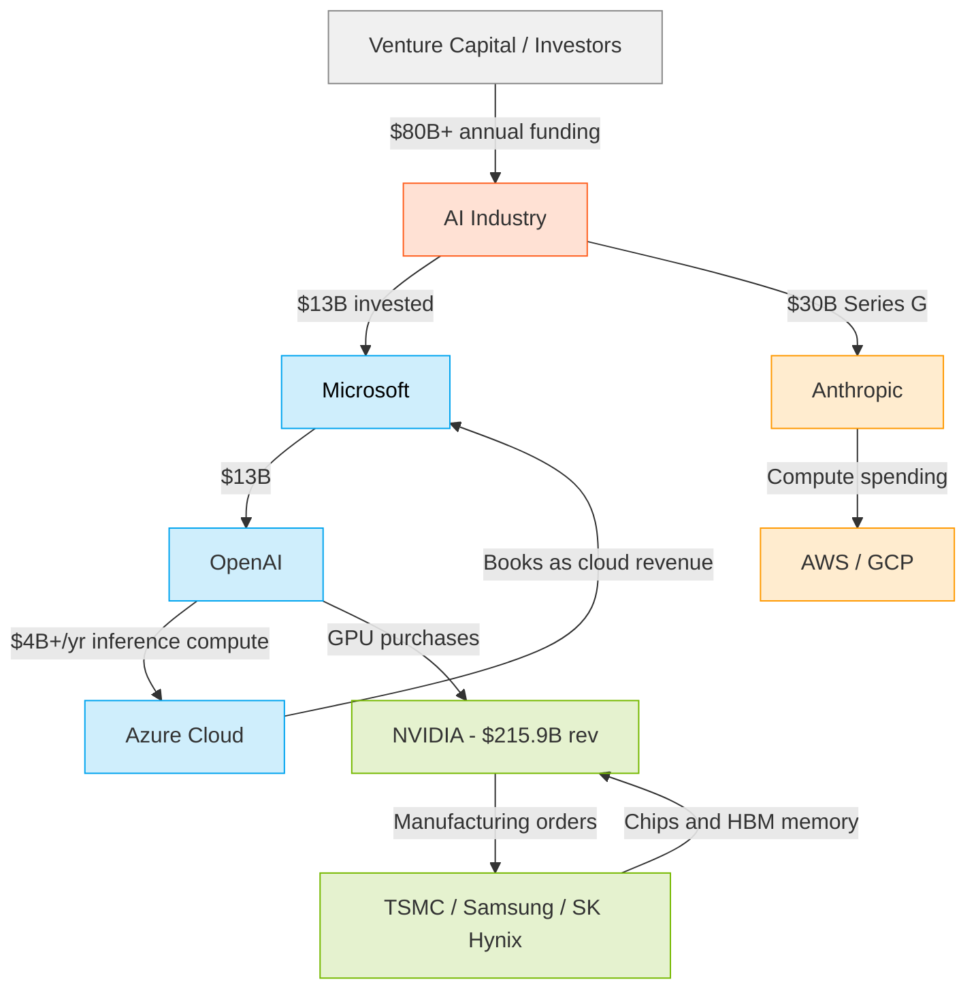

# The $1.4 Trillion Circular Economy: How AI Capital Flows in a Closed Loop

Walk into any AI conference, and you'll hear the same story: artificial intelligence is the most transformative economic force since electricity. Funding is flowing in from every direction — venture capital, corporate balance sheets, sovereign wealth funds. In 2025 alone, the AI industry raised over $80 billion in new capital.

But look closer at where that money comes from — and where it goes — and a more unsettling picture emerges. A significant share of the AI industry's revenue circulates within a closed loop of roughly two dozen companies, raising fundamental questions about whether the economics of frontier AI are truly sustainable or simply self-referential.

## The Microsoft-OpenAI-Azure Triangle

The most visible circular loop involves Microsoft, OpenAI, and Azure. Over the course of several investment rounds, Microsoft has committed approximately $13 billion to OpenAI. In exchange, OpenAI agreed to run a substantial portion of its compute workload on Microsoft's Azure cloud platform.

This structure creates a tidy accounting circle: Microsoft's investment dollars flow to OpenAI, which uses them to pay for Azure compute, which Microsoft books as "AI revenue." When Microsoft reports $40+ billion in annualized Azure AI revenue, a non-trivial portion represents OpenAI's own spending. Each dollar cycles through Microsoft → OpenAI → Azure → Microsoft, inflating the headline numbers at every stop.

This isn't hypothetical. In 2025, the Financial Times reported that OpenAI was spending over $4 billion annually on inference compute alone — the majority of which went to Microsoft's Azure cloud. When OpenAI's operating losses hit $20.9 billion in 2025 (on just $13 billion in revenue), those losses were partially offset on Microsoft's balance sheet as cloud revenue. The same dollars appear as a liability at OpenAI and an asset at Microsoft — but on a consolidated basis, much of this is internal reshuffling.

## The NVIDIA Reinvestment Engine

NVIDIA's position reveals an even larger circular dynamic. In fiscal year 2025, NVIDIA reported $215.9 billion in total revenue, with 68% coming from its data center segment — effectively, AI GPU sales. The company's gross profit was $181.6 billion, a staggering 84% gross margin that exceeds any other major semiconductor company in history.

But here's where the circularity kicks in. NVIDIA invests enormous sums back into its supply chain: TSMC, Samsung, and SK Hynix — the companies that manufacture its chips and supply its high-bandwidth memory (HBM). Bloomberg and Reuters have documented that NVIDIA is the single largest customer for TSMC's advanced CoWoS packaging and for HBM3e memory production.

Those same suppliers — TSMC, Samsung, SK Hynix — are themselves racing to expand capacity for the AI boom. And who is buying their expanded output? NVIDIA, and through NVIDIA, the same hyperscalers (Microsoft, Amazon, Google) that form the other half of the loop. The supply chain revolves around producing capacity for a demand that is itself substantially generated by the same players.

When you step back, a large fraction of NVIDIA's $215.9 billion in revenue is technically "external" but ultimately interconnected within a network of perhaps 20 companies: the hyperscalers (Microsoft, Amazon, Google), the AI labs (OpenAI, Anthropic), the hardware suppliers (TSMC, Samsung, SK Hynix), and the venture investors (SoftBank, Sequoia, Andreessen Horowitz). This is not a conspiracy — it is the natural consequence of an industry that requires astronomical upfront investment and where the barriers to entry at each layer are measured in the billions of dollars and years of engineering time. The hyperscalers are simultaneously the largest investors in, and the largest customers of, the AI labs; NVIDIA is simultaneously the dominant chip supplier and the single largest customer of its own supply chain. Every dollar in the system touches at least three nodes in the loop before it reaches the real economy.

## Anthropic's $380 Billion Valuation Mirage

Anthropic's trajectory illustrates the circular dynamic particularly clearly. The company raised approximately $30 billion in its Series G round, reaching a $380 billion valuation. Its annualized revenue run rate was reported at roughly $45 billion — impressive by startup standards, but thin relative to its valuation, which implies a multiple of over 8x revenue in a market where most enterprise software companies trade at 5-10x public multiples. The difference is that those public companies are profitable.

The key question: how much of that revenue comes from outside the closed loop? When Anthropic reports $45 billion in ARR, a significant portion flows from companies within the same interconnected network — VC-backed startups spending raised capital on API credits, and enterprises already embedded in the AWS/GCP ecosystem that backs Anthropic. The company's compute costs, running primarily on AWS and GCP, are similarly structured to create circular flows between Anthropic and its cloud providers. Amazon, which led key investment rounds, also books Anthropic's compute spending as AWS revenue.

The AI Industry Interconnections Map, compiled from public filings and disclosed deals, tracks over $200 billion in what could be characterized as "circular" capital flows — investments and revenue arrangements between interconnected AI companies. This is capital that moves within the industry rather than flowing to the broader economy in the form of wages, dividends, or consumer surplus.

To put the concentration in perspective: Microsoft has invested $13 billion in OpenAI, while OpenAI's annual revenue is also roughly $13 billion — and its operating loss is $20.9 billion. NVIDIA's revenue of $215.9 billion comes with an 84% gross margin, meaning it keeps $181.6 billion after direct costs. Anthropic's $380 billion valuation rests on $45 billion in annualized revenue. Each of these numbers, by itself, is remarkable. Taken together, they describe an industry where the headline figures at every layer depend on the headline figures at every other layer.

## What This Means

None of this is to suggest fraud or improper behavior. Inter-firm investment is a normal feature of any technology ecosystem. But the scale of circularity in today's AI industry is historically unusual.

The semiconductor boom of the 1990s, for comparison, served a genuinely diverse customer base: PCs, telecommunications, automotive, consumer electronics, industrial equipment. AI chip demand today is overwhelmingly concentrated in a single use case — large model training and inference — serving a small number of hyperscale customers who are simultaneously the investors in, and customers of, the AI labs that use the chips.

This creates a systemic risk: if any node in the loop falters, the contraction may cascade more quickly than traditional metrics suggest. When OpenAI's $20.9 billion operating loss meets Microsoft's need to show ROI on its $13 billion investment, and when NVIDIA's $215.9 billion revenue base depends on hyperscaler AI buildout that depends on AI lab revenue that depends on VC funding, the entire structure rests on continued capital availability.

The AI industry may not be a bubble in the traditional sense — many of these companies are building genuinely valuable technology. But it is a circular economy, and circular economies are vulnerable to the same dynamic that ended every previous technology capital cycle: the moment when the outside capital that feeds the loop decides it wants its money back.

---

*Sources: Bloomberg (NVIDIA FY2025 earnings); Financial Times (OpenAI financials, Azure AI revenue); Sacra Research (Anthropic Series G terms); AI Industry Interconnections Map (circular capital flow analysis); Reuters (TSMC CoWoS capacity allocation); SEC filings (Microsoft/OpenAI investment disclosures).*